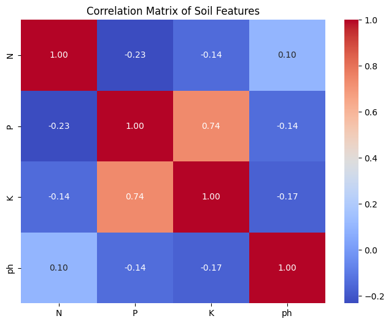
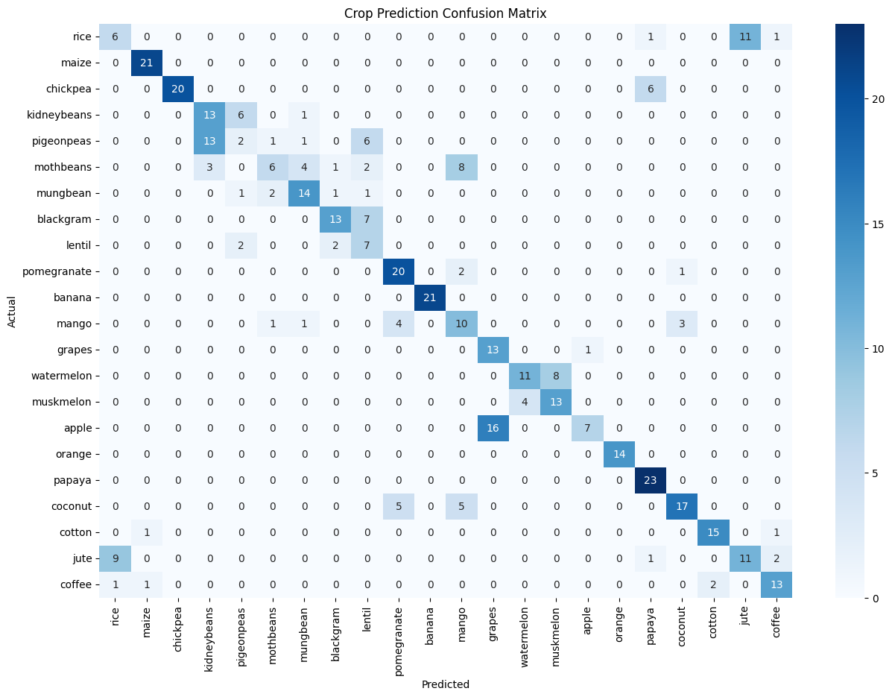

# Sowing Success: AI-Driven Crop Recommendation 🌾

### 🎯 Objective
To help farmers optimize crop yields by predicting the best crop type based on soil Nitrogen (N), Phosphorous (P), Potassium (K), and pH levels.

### 📊 Key Results
* **Best Model:** SVM (RBF Kernel) with **73% Accuracy**.
* **MVP Feature:** **Potassium (K)** was identified as the strongest individual predictor (F1-score: 0.18).
* **Impact:** Demonstrates how low-cost soil testing (prioritizing K) can still provide high-value insights.

### 🛠️ Tech Stack
* **Python** (Pandas, NumPy)
* **Scikit-Learn** (Logistic Regression, SVM, StandardScaler)
* **Matplotlib & Seaborn** (Confusion Matrix Heatmaps)

## 📊 Exploratory Data Analysis
Here we look at how soil features relate to one another.

---

## 🤖 Model Performance
### Baseline: Logistic Regression
The initial model reached 66% accuracy. The confusion matrix below highlights the linear overlaps.

